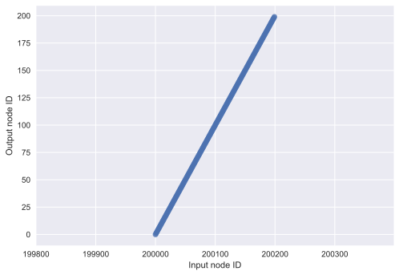

# Tracking the genealogy during forward simulation

This tutorial will cover several use cases of `tskit` for forward simulations.  We start with a simple Wright-Fisher simulation with no selection and no recomination, and gradually increase the complexity of our examples until we are recording mutations, ancient samples, and associated meta-data.


```python
%matplotlib inline
%config InlineBackend.figure_format = 'svg'
from IPython.display import SVG
import msprime
import numpy as np
import matplotlib.pyplot as plt
import seaborn as sns
```


```python
msprime.__version__
```


    '0.5.0b3.dev10+g1296d0a'


## Definitions

Before we can make any progress, we require a few definitions.  We will focus on the case of diploids, but the concepts used here generalize to any ploidy. Actually, things generalize to any mixtures of ploidys if you are willing to do the book-keeping!

A *node* is used to label the birth time of a lineage.  A node can be described by a tuple, `(id, time)`, where `id` is unique and `time` reflects the birth time of that `id`. A *diploid* is a pair of nodes.

For the case of the discrete-time Wright-Fisher (WF) model, if $N$ individuals currently exist at time point $t$, then there are $2N$ nodes, $[i,i+2N)$, and the diploids are defined as tuples of pairs of adjacent nodes, $D \in [(i,i+1),(i+2,i+3),\dots,(2N-2,2N-1)]$, where each $(i,j)$ pairing is a diploid.

An *edge* reflects a transmission event between nodes.  An edge is a tuple `(left, right, parent, child)` whose meaning is "Parent $P$ passed on the genomic interval $[l,r)$ to child $C$".

The goal of this tutorial is to work through the book-keeping required to generate nodes and edges forwards in time and "simplify" them into the minimal set of nodes and edges that describe the history of the sample.

All of our simulations will follow the parameter scaling laid out by Dick Hudson's `ms` software, which is also used in `mspms`, a command-line script that is part of [msprime](https://github.com/jeromekelleher/msprime).

We also need to define what we mean by time, which is simple for the discrete-time model.  A simulation will start at generation 0, which consists of $2N$ parental nodes (nodes $[0,2N)$) and no edges. We will simulate forwards in time for $g$ generations, starting with $g = 1$ (the first offspring generation).  In generation $g$, we will add nodes with `id` values $[2Ng,2N(g+1))$ and `time` value $g$ to the `NodeTable`.

The simplification algorithm works with respect to a *sample*.  Here, a sample will refer to the most recent generation simulated *plus* any ancient samples that are being tracked.

## A Wright-Fisher simulation with no recombination

Here, we simulate a constant-sized Wright-Fisher population of $N$ _diploid_ individuals with no mutation, no recombination, and no selection.  We generate nodes and edges as we go, simplify once at the end, and add mutations with msprime.

The mechanics of transmission in this case are simple.  Each generation simply adds $2N$ more nodes to a `NodeTable` and $2N$ edges to an `EdgeTable` (one for each paretal gamete).  In the absence of recombination, an offspring inherits the interval $[0,1)$ from each of two parental nodes.  To generate an offspring, we pick two parents, and then one node from each parent, and create edges reflecting the transmission.

The simulation is shown in the following function:


```python
def wf1(N, ngens):
    """
    Constant-sized WF model with no mutation, no recombination, no selection,
    and no simplification.
    """
    nodes, edges = msprime.NodeTable(), msprime.EdgeTable()
    
    # Add 2N nodes at time = 0.
    # These nodes represent the 
    # initial list of parental
    # gametes
    for i in range(2*N):
        nodes.add_row(time=0)
    
    next_offspring_index = len(nodes)
    first_parental_index = 0
    for gen in range(1,ngens+1):
        assert(next_offspring_index == len(nodes))
        assert(first_parental_index == len(nodes) - 2*N)
        # Pick 2N parents
        parents = np.random.randint(0, N, 2*N)
        for parent1, parent2 in zip(parents[::2], parents[1::2]):
            # Pick 1 gamete from each parent
            mendel = np.random.random_sample(2)
            g1 = first_parental_index + 2*parent1 + (mendel[0] < 0.5)
            g2 = first_parental_index + 2*parent2 + (mendel[1] < 0.5)

            # Add nodes for our offspring's
            # two gametes
            nodes.add_row(time=float(gen))
            nodes.add_row(time=float(gen))
  
            # Add edges reflecting the
            # transmission from parental
            # nodes to offspring nodes
            edges.add_row(left=0.0, right=1.0, parent=g1, child=next_offspring_index)
            edges.add_row(left=0.0, right=1.0, parent=g2, child=next_offspring_index+1)
            
            next_offspring_index += 2
            
        first_parental_index += 2*N
        
    return (nodes,edges)
```

Let's run the simulation, simulating 100 diploids for 1,000 generations:


```python
np.random.seed(42)
nodes, edges = wf1(100,1000)
```

### Simplifying the output

First, we have to convert time from forwards to backwards, and reset the node table accordingly.

**Detail:** We also set the "flags" to 1 for each node, marking it as a sample.


```python
t = nodes.time
t -= t.max()
t *= -1.0
flags = np.ones(len(nodes),dtype=np.uint32)
nodes.set_columns(time=t,flags=flags)
```

Our "samples" will be all nodes from the last generation simulated, which is now the nodes with `time` equal to 0.0.


```python
samples=np.where(nodes.time == 0.0)[0]
```

We are now ready to sort, simplify, and load tables:


```python
msprime.sort_tables(nodes=nodes,edges=edges)
node_map = msprime.simplify_tables(samples=samples.tolist(),nodes=nodes,edges=edges)
ts = msprime.load_tables(nodes=nodes,edges=edges)
```

Let's take a look at the result:


```python
SVG(next(ts.trees()).draw(height=200,width=200, node_labels={len(ts.tables.nodes)-1:'root'}))
```


The `node_map` returned from the simplify function is the same length as our input (un-simplified) node table.  Each element has a value of -1 if the input node is not an output node (e.g., it was "simplified out" of the final data), otherwise it contains the index of the node in the simplified node table.  Let's look at the relationship between the indexes for the final generation before and after simplification:


```python
p = sns.regplot(x=samples,y=node_map[samples],fit_reg=False)
p.set(xlabel="Input node ID",ylabel="Output node ID")
```


    [<matplotlib.text.Text at 0x11bf28390>, <matplotlib.text.Text at 0x11bf10b70>]





The above figure is quite important: when we simplify with respect to the *last* generation simulated, those nodes become the *first* nodes in the simplified tables!  The reason is because our simplified tables represent time from the present to the past.  The implication is that our simple book-keeping of `next_offspring_index` and `first_parental_index` will be less simple when we apply the simplification step *during* a forward simulation instead of once at the end.
